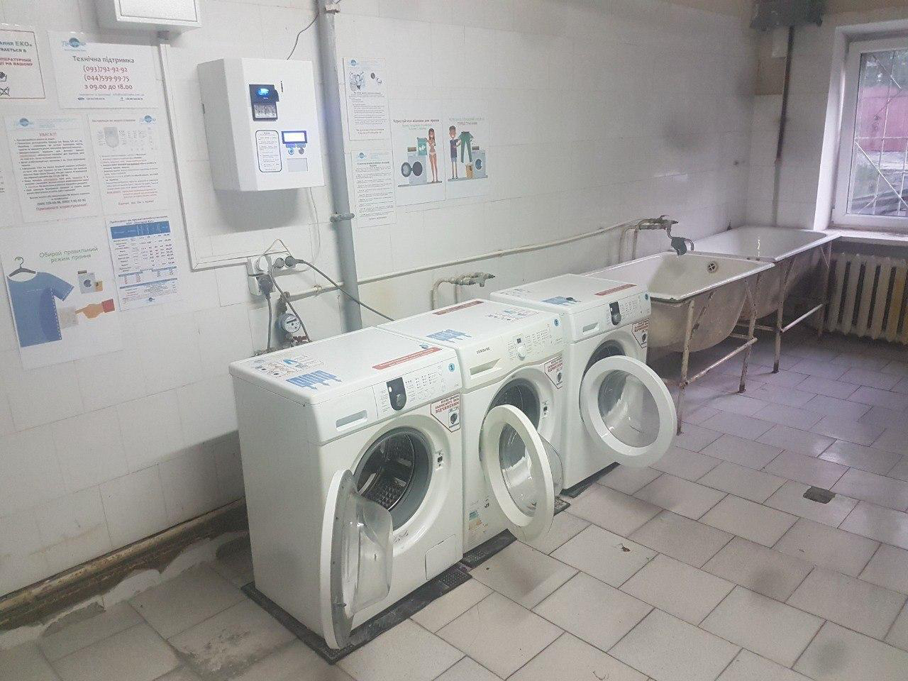
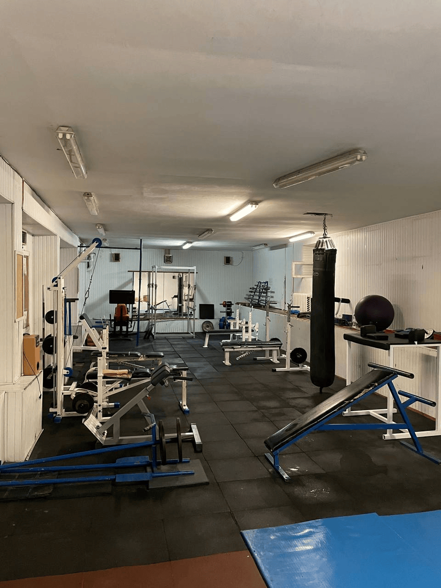
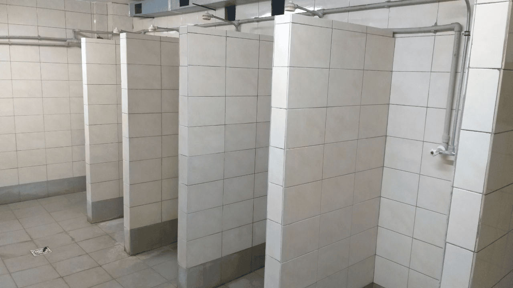
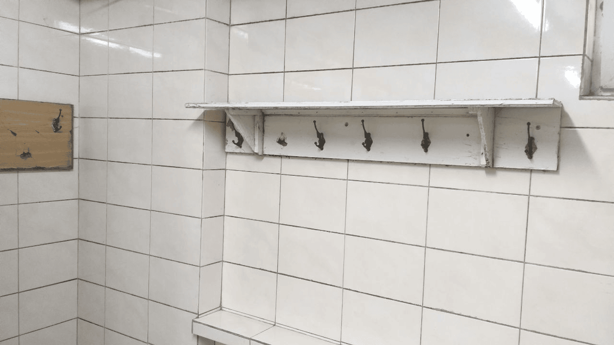
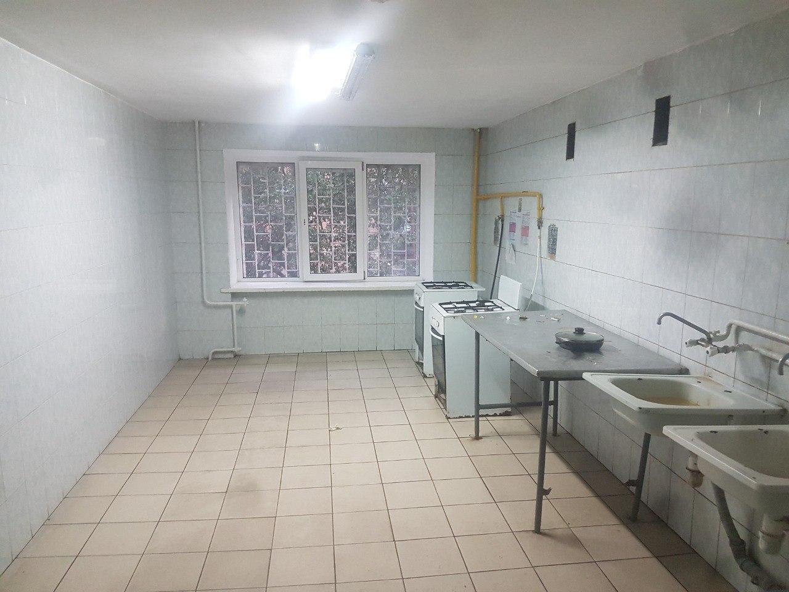
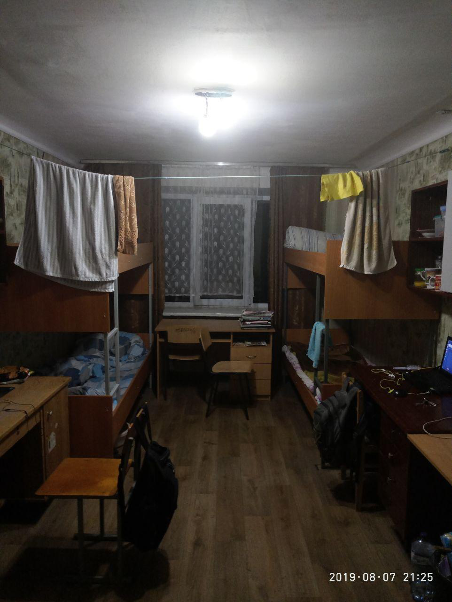
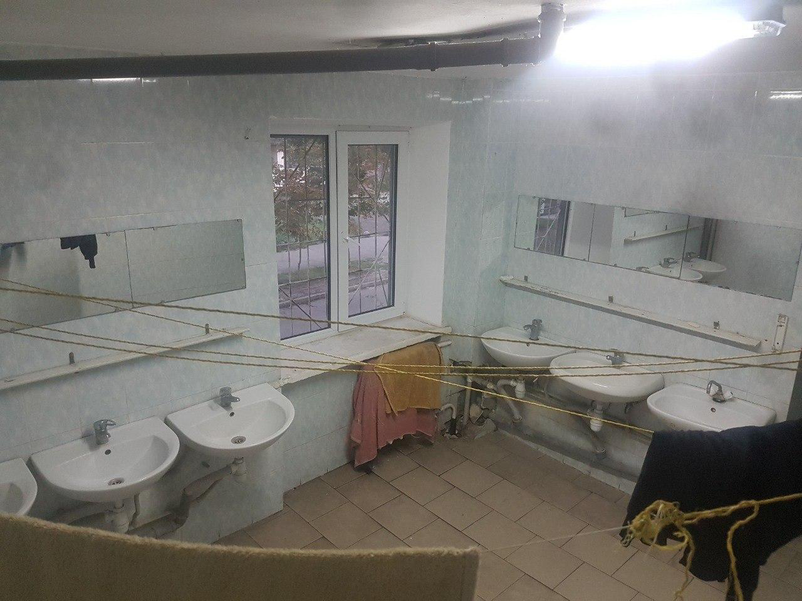

# Гуртожиток №14 [[↩]](../../README.md)

>Телеграм [[чат]](https://t.me/+CY2mWIgn5MhmOGNi) та [[канал]](https://t.me/kpi_hostel14)\
  > \* Якщо лінка на чат не працює, перейдіть у: канал > три крапочки > View Discussion/Переглянути обговорення

>📍Адреса: [03057, пров. Ковальський 5.](https://www.google.com/maps/place/50%C2%B026'58.5%22N+30%C2%B027'01.5%22E/@50.4495683,30.4504275,17z)

|Тип       |Поверхи      |Ліфт     |
|:---------|:------------|:--------|
|коридорний|5 + цокольний|відсутній|

### Завідуюча гуртожитком: Шевчук Олена Вікторівна

  + Телеграм: @ElenaShevch

  + Кабінет: знаходиться на 1 поверсі у правому крилі.

## Умови проживання

+ Стан поверхів: Нещодавно робився косметичний ремонт стін та стель, нове освітлення.

+ Вікна: усі вікна (окрім кількох кімнат) пластикові.

+ Туалети: два туалети на кожному поверсі: чоловічий та жіночий. На першому поверсі один у лівому крилі.

+ Умивальні: по дві умивальні на кінцях коридору на кожному поверсі. На першому поверсі лише одна.

+ Робоча кімната: на першому поверсі, є Wi-Fi, розетки, фліпчарт та столи.

### Пральня

Знаходиться на першому поверсі, наступна кімната після чоловічого та жіногочо душів із трьома машинками з купюроприймачем. 

+ **Оплата** - є купюроприймач, також можна оплатити картою через застосунок Mate

  >Mate у [[Google Play]](https://play.google.com/store/apps/details?id=com.vendypayApp) | [[App store]](https://apps.apple.com/ua/app/mate/id1546433332)

+ Мотузки для білизни у окремих кімнатах на всіх поверхах, окрім першого
  > *але краще зберігати речі у кімнатах, інакше щось може пропасти) 

### Спортзал

+ Знаходиться в підвалі. 

+ Коштує 100 гривень на місяць для хлопців, та безкоштовно для дівчат. (за абонементом звертатись до Івана Кеби (легенда, тг: [@Assistan_t](https://t.me/Assistan_t)))

+ Є окрема тенісна кімната зі столом, але ракетки та м'яч потрібні свої. Вхід вільний

### Душ

+ Є дві душові кімнати на першому поверсі - чоловіча та жіноча

+ З собою треба мати якісь капці мильнички щоб не схопити грибок

+ Гаряча вода у гуртожитку канонічно зникає влітку 

## Фото

### Кухня

### Середньостатиснична кімната 

### Умивальники 

# Які речі брати/не брати в гуртожиток
Ну почнем з того, що якщо ви плануєте приїжджати машиною, там ніяких обмежень думаю нема бо не прийдеться тягнути ці речі в руках, цей гайдик більшу для тих хто буде їхати потягом\автобусом і тд.

### Що брати НЕ треба:
 + ПОСУД, в плані тарілок, виделок, ложок, ножів і можливо кастрюль та сковорідок - все це або буде в кімнаті або можна купити в аврорі\червоному маркеті
 + ПОСТІЛЬ, її тут видають, але краще взяти свою наволочку та простирадло, ви скоріше за все через місяць-два захочете норм матрац, а може й ні, тому тут краще спробувати.
 + ХОЛОДОС, я думаю це очевидно, але вони є у 99% кімнат і навіть якщо в вашій не буде скажите про це завідуючій при поселенні і вона найде, інше питання в тому що стан цього холодосу це вже як повезе типу є нові є ще радянські. 
 + ВЕСЬ ОДЯГ, не беріть його одразу весь, краще візьміть необхідний мінімум на 3 дні, а решту щоб потім вам переслали новою поштою.
 + ДОФІГА ЇЖІ, якщо що залутаєте вже потім передачкою.

### 50 на 50 (те що можна і взяти, а можна і купити)
 + ЗАСОБИ ГІГІЄНИ зубну щітку, зубну пасту, гель для душу, мочалку, рушник, можна і тут купити, але можна і взяти з дому.

### Що брати точно треба:
 + НОУТ і ЗАРЯДКУ ДО НЬОГО
 + ТЕЛЕФОН і ЗАРЯДКУ ДО НЬОГО
 + ДОВІДКИ ДЛЯ ПОСЕЛЕННЯ
 + РЕЗИНОВІ ТАПОЧКИ ДЛЯ ДУШУ, можете їх і тут купити, але щоб були обов'язково.
 + АПТЕЧКУ ПІД СЕБЕ

ну а далі дивіться за власної потреби можна і електрогітару привезти і другий монік.
